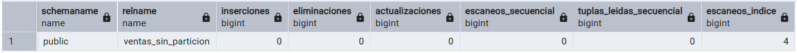

# BD2: practica 4

Fecha de creación: 3 de octubre de 2025 12:19
Clase: BD2
Descripción: Diseño físico y particionamiento

# Implementación y Análisis de Particionamiento en PostgreSQL

## Introducción

- **Contexto:** importancia de la optimización en bases de datos con grandes volúmenes de datos.
- **Objetivo:** demostrar las ventajas del particionamiento frente a tablas no particionadas.
- **Herramientas:** PostgreSQL, extensiones `pg_stat_statements`, `pgcrypto`.

### 1. Configuración inicial del sistema

### 1.1 Extensiones habilitadas

- `pg_stat_statements` (monitoreo de consultas).
- `pgcrypto` (funciones criptográficas).

### 1.2 Parámetros de logging

- `log_min_duration_statement = 1000` (registrar consultas >1s).
- `log_statement = 'all'` (registro completo de consultas).

---

## 2. Creación de datos de prueba

### 2.1 Tabla sin particionamiento

- Definición de la tabla `ventas_sin_particion`.
- Índices creados: por `fecha_venta` y `cliente_id`.

### 2.2 Generación masiva de datos

- Función `generar_ventas_masivas(num_registros)` para insertar registros aleatorios.
- Inserción de **2 millones de registros**.

### 2.3 Análisis inicial de rendimiento

- Consultas de estadísticas (`pg_stat_user_tables`).

- Medición de tamaño (`pg_size_pretty`).

---

## 3. Particionamiento por rango

### 3.1 Creación de tabla particionada

- Definición de `ventas_particionada` con particiones por año (2020–2024).

### 3.2 Índices en particiones

- Índices en `cliente_id`, `producto_id`, `sucursal_id`.

### 3.3 Migración de datos

- Inserción de datos desde `ventas_sin_particion` a `ventas_particionada`.
- Verificación de distribución de registros.

---

## 4. Particionamiento híbrido (rango + hash)

### 4.1 Definición de tabla híbrida

- Tabla `ventas_hibrida` con partición por rango y subparticiones hash en 2024.

### 4.2 Subparticiones hash

- Creación de subparticiones:
    - `ventas_2024_he`
    - `ventas_2024_h1`
    - `ventas_2024_h2`
    - `ventas_2024_h3`

### 4.3 Carga de datos

- Inserción de datos correspondientes al año 2024.
- Validación de distribución en subparticiones.

---

## 5. Análisis comparativo de rendimiento

### 5.1 Consultas por rango de fechas

- Comparación entre tabla sin partición y particionada.

### 5.2 Consultas específicas por cliente

- Comparación entre tabla sin partición y tabla híbrida (hash).

### 5.3 Partition pruning

- Verificación del uso de `partition pruning`.

### 5.4 Registro de métricas

- Creación de tabla `metricas_rendimiento`.
- Función `medir_consulta` para almacenar resultados.

---

## 6. Mantenimiento automatizado

### 6.1 Creación automática de particiones

- Función `crear_particion_mensual(tabla, año, mes)`.

### 6.2 Limpieza de particiones antiguas

- Función `limpiar_particiones_antiguas(tabla, meses_retener)`.

---

## 7. Conclusiones

- Beneficios observados del particionamiento en consultas de grandes volúmenes.
- Comparación de tiempos entre tablas normales, particionadas y particionadas híbridas.