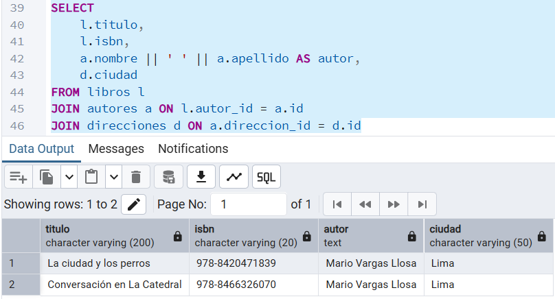

# BD2: base de datos orientada a objetos

Fecha de creación: 3 de noviembre de 2025 17:59
Clase: BD2
Descripción: Practica orientada a objetos

### PASO 4

### RESUMEN - MODELADO RELACIONAL TRADICIONAL

Numero de TABLAS = 3

Numero de JOINS = 2

### PASO 8

### RESUMEN - MODELADO OBJETO RELACIONAL

Numero de TABLAS = 1

Numero de JOINS = 0

Numero de TYPES = 2

## PARTE 3

### PASO 9

Resultados Idénticos

### PASO 10

| Característica | Modelo Relacional | Modelo Objeto-Relacional |
| --- | --- | --- |
| Número de tablas necesarias | 3 (libros, autores, direcciones) | 1 (libros_oo) |
| Complejidad de consultas | Alta, utiliza varios JOINS entre tablas | Media, los datos se manejan a través de tipos compuestos |
| Normalización | Alta, hay una tabla para cada entidad lo que reduce la redundancia | Baja, ya que integra tipos compuestos en los que se repiten los mismos datos en diferentes registros |
| Facilidad de actualización | Media, más practico para mantener consistencia, pero necesitaremos utilizar múltiples operaciones en varias tablas  | Fácil, más simple, pero puede llevarnos a perder consistencia |
| Consistencia de datos | Alta, debido a la utilización de claves foráneas y relaciones normalizadas | Baja, tiene complicaciones con el control referencial |
